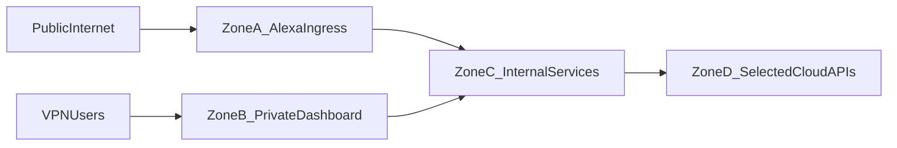

# Jarvis Security Architecture and Threat Model

## 1) Security Objectives
- Protect family personal data and behavioral metadata.
- Minimize internet exposure while preserving Alexa voice entry.
- Enforce least privilege across users, services, and integrations.
- Guarantee auditability for sensitive actions.

## 2) Security Scope
In scope:
- Network boundaries (public ingress, VPN, internal services)
- Authentication and authorization
- Secret management and token lifecycle
- Data protection, retention, and backups
- Monitoring, alerting, and incident response

Out of scope (for MVP):
- Hardware tamper resistance on consumer voice devices
- Enterprise SIEM integration beyond baseline log export

## 3) Trust Zones

- Zone A: public ingress endpoint for Alexa requests only.
- Zone B: VPN-only dashboard and management surfaces.
- Zone C: internal services and data stores.
- Zone D: selected cloud APIs (Google integrations, optional cloud LLM).

## 4) Threat Model (STRIDE-Oriented)
### 4.1 Spoofing
- Risk: forged Alexa requests or impersonated users.
- Controls:
  - Verify Alexa request signatures and timestamp freshness.
  - Require authenticated dashboard sessions over VPN.
  - Require PIN/app confirmation for sensitive actions.

### 4.2 Tampering
- Risk: command payload modification in transit.
- Controls:
  - TLS for all external traffic.
  - Signed or mutually authenticated service traffic for privileged internal calls.
  - Strict schema validation and command allowlists.

### 4.3 Repudiation
- Risk: inability to prove who triggered a sensitive action.
- Controls:
  - Append-only audit log with actor/source/context.
  - Correlation IDs across ingress, core, connector, scheduler.
  - Approval records for gated actions.

### 4.4 Information Disclosure
- Risk: leakage of family data through logs, integrations, or cloud LLM use.
- Controls:
  - Data minimization for outbound requests.
  - Explicit opt-in for cloud LLM use per request.
  - Redaction of sensitive values in logs.
  - Encryption at rest for persistent storage.

### 4.5 Denial of Service
- Risk: ingress flooding or dependency outages.
- Controls:
  - Rate limits and request body limits at ingress.
  - Circuit breakers/retries for cloud connectors.
  - Queue-based backpressure in scheduler pipelines.

### 4.6 Elevation of Privilege
- Risk: child/user/device executes adult-level commands.
- Controls:
  - Role-based policy engine (`adult`, `child`, `system`).
  - Sensitive command classes always require second factor (PIN/approval).
  - Command source attestation and policy evaluation per request.

## 5) Authentication and Authorization Model
### 5.1 Identities
- Household users (adults/kids)
- System service identities
- Device identities (dashboard clients, trusted admin endpoints)

### 5.2 Authorization
- Policy outcomes: `ALLOW`, `DENY`, `REQUIRE_CONFIRMATION`.
- Sensitive actions:
  - Calendar write/delete
  - Purchases/reservations
  - IoT control (future)
  - External communication actions

### 5.3 Confirmation Paths
- Voice PIN (time-bound verification session)
- App/dashboard confirmation over VPN

## 6) Network Security Controls
- Only one public route: `/alexa/webhook` on hardened ingress.
- Dashboard and management APIs unavailable from public internet.
- VPN required for household remote access and admin operations.
- Firewall default deny; allow explicit ports only.
- Ingress controls:
  - Rate limits
  - Request size limits
  - IP anomaly detection
  - WAF-style validation where feasible

## 7) Secrets and Key Management
- Secrets never committed to repository.
- Local development can use `.env` with strict local file permissions.
- Runtime should prefer encrypted secret stores and environment injection.
- Rotation policy:
  - API tokens on schedule
  - Immediate rotation on suspected compromise
- Audit every secret change event.

## 8) Data Protection and Retention
- Data classes:
  - P0: credentials, tokens, PIN artifacts
  - P1: family schedules/tasks, approval records
  - P2: operational telemetry and anonymized metrics
- Encryption:
  - At rest: encrypted volumes/database settings
  - In transit: TLS internal/external as appropriate
- Retention defaults:
  - Raw command transcripts: short retention window
  - Audit logs: long retention for accountability
  - Derived summaries: user-configurable retention

## 9) Logging, Monitoring, and Alerting
- Log events:
  - Auth successes/failures
  - Policy decision outcomes
  - External API calls and failures
  - Sensitive action approvals/denials
- Alert conditions:
  - Repeated signature verification failures
  - Unusual ingress traffic spikes
  - Excessive denied sensitive actions
  - Token refresh failures

## 10) Incident Response Runbook (MVP)
1. Detect and classify severity.
2. Contain:
   - Disable public ingress if needed.
   - Revoke affected tokens.
3. Eradicate and recover:
   - Patch root cause.
   - Restore from known-good backups if required.
4. Post-incident review:
   - Timeline, impact, permanent controls.

## 11) Hardening Checklist
- [ ] Alexa signature/timestamp verification enforced
- [ ] Public endpoint limited to Alexa route only
- [ ] VPN enforced for dashboard/admin
- [ ] Sensitive commands require confirmation
- [ ] Secret rotation process documented and tested
- [ ] Backup and restore tested
- [ ] Log redaction verified
- [ ] Rate limiting and DoS protections enabled
- [ ] Dependency update policy defined

## 12) Residual Risks
- Alexa cloud mediation remains external dependency.
- Consumer household device ecosystem has variable security maturity.
- Human-factor risk (weak PIN reuse) requires onboarding and education.
