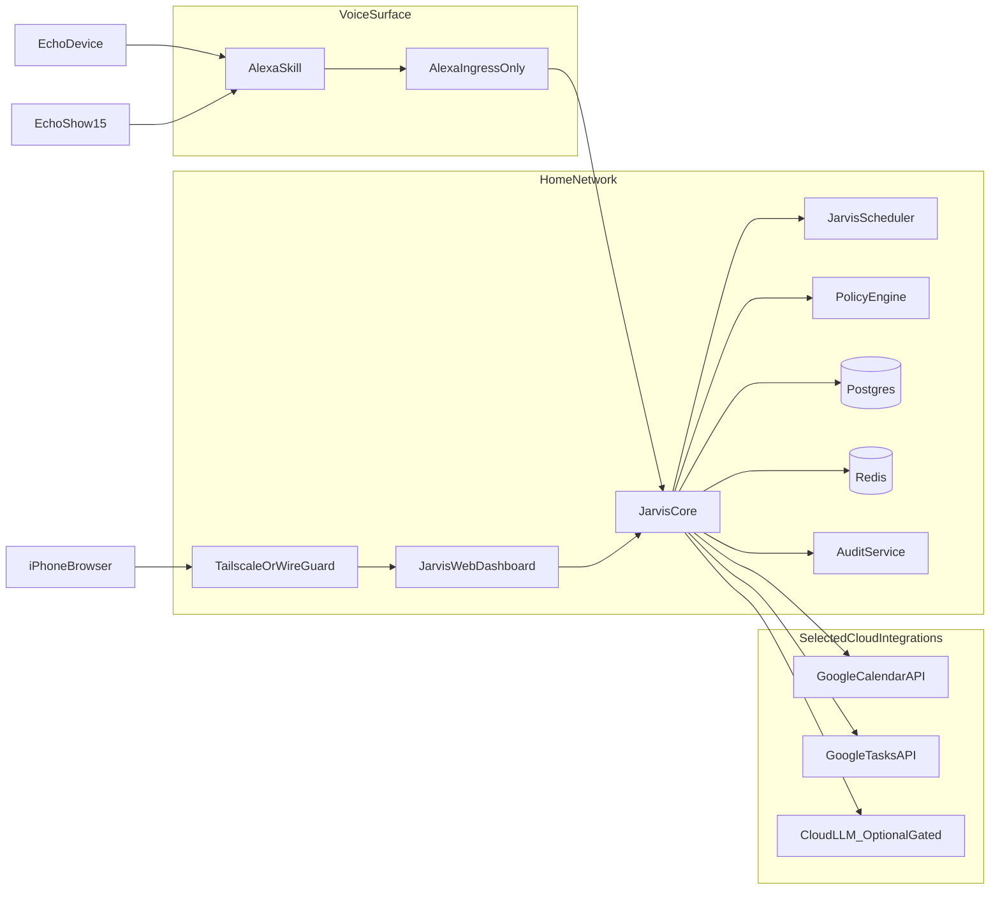

# Jarvis Architecture and Product Specification

## 1) Purpose and Scope
Jarvis is a local-first, family assistant platform running on a 2024 Mac Mini M4 (24GB RAM). It provides calendar/task automation, voice interaction through existing Alexa devices, secure household controls, and a web dashboard usable from iPhone and other trusted devices.

This document defines:
- System architecture and runtime boundaries
- Security model and trust zones
- Service decomposition and ownership
- End-to-end API flows for voice, calendar, and dashboard operations
- MVP acceptance criteria and phase expansion strategy

## 2) Product Goals
- Keep personal and family data private with strong local defaults.
- Support daily household operations (calendar, reminders, scheduling) with low friction.
- Provide voice-first access from existing Echo and Echo Show devices.
- Expose a secure dashboard for review, approvals, and control.
- Allow iterative extension by a Python engineer (modular, testable, observable).

## 3) Non-Goals (MVP)
- Full autonomous IoT control across all vendors.
- Full Alexa hardware/software replacement on Echo Show.
- Unbounded autonomous internet actions without approval controls.
- Fully automated school-email event ingestion (Phase 2).

## 4) Locked Decisions
- Deployment: Docker-first on Mac Mini, with native fallback only for latency-sensitive model serving.
- Privacy posture: local-first with selected cloud integrations.
- Cloud LLM usage: optional, explicit per-request approval.
- Ecosystem: Google-first integrations.
- Remote access: VPN-only for dashboard/admin surfaces.
- Voice bootstrap: existing Alexa devices (Echo upstairs + Show downstairs).
- Public ingress exception: Alexa-only HTTPS endpoint with strict hardening.
- Sensitive actions: spoken PIN and/or app confirmation.
- MVP calendars: family shared + spouse personal + work calendar read-only.
- Phase 2 priority: email summary + school-event extraction.

## 5) System Context

## 6) Runtime and Deployment Architecture
### 6.1 Host and Container Strategy
- Primary runtime: Docker Compose on Mac Mini.
- Internal east-west traffic restricted to private Docker network.
- Only one public entrypoint allowed: `jarvis-alexa-ingress`.
- Dashboard and admin APIs bound to private interfaces; reachable through VPN only.

### 6.2 Performance Policy
- Benchmark p95 latency for core flows under Docker vs native.
- Keep Docker-first unless p95 degradation exceeds 15-20% for target commands.
- If threshold exceeded, move only local model-serving process to host-native; keep control plane containerized.

### 6.3 Suggested Service Topology
- `jarvis-core` (FastAPI): orchestration, intent execution, integration routing.
- `jarvis-policy` (library/module or sidecar): authorization and action gating.
- `jarvis-scheduler`: recurring jobs, reminders, catch-up sync tasks.
- `jarvis-web`: dashboard frontend + authenticated API client.
- `jarvis-alexa-ingress`: Alexa request verification and normalization.
- `jarvis-connectors-google`: calendar/task APIs and token lifecycle.
- `jarvis-audit`: immutable action/event logs.
- `postgres`: system-of-record for household state.
- `redis`: queue/cache/session ephemeral state.

## 7) Service Boundaries and Responsibilities
### 7.1 `jarvis-core`
- Accepts normalized commands from voice/dashboard.
- Resolves subject (user context), intent, and required permissions.
- Delegates to connector/scheduler layers.
- Returns response payload for TTS and dashboard rendering.

### 7.2 `jarvis-policy`
- Evaluates role-based policies (adult, child, system).
- Marks action as `ALLOW`, `DENY`, or `REQUIRE_CONFIRMATION`.
- Applies sensitivity rules (calendar write, purchases, IoT controls, external sends).

### 7.3 `jarvis-alexa-ingress`
- Receives HTTPS POST requests from Alexa skill endpoint.
- Verifies request signature/timestamp and anti-replay constraints.
- Maps voice intents to internal command envelope.
- Never performs business logic directly.

### 7.4 `jarvis-connectors-google`
- Handles OAuth token provisioning, refresh, revocation behavior.
- Offers idempotent methods for read/write task/calendar actions.
- Enforces work calendar read-only constraints.

### 7.5 `jarvis-scheduler`
- Executes reminders, recurring tasks, monthly date-night checks.
- Uses durable job storage and retry policy with backoff.
- Emits completion/failure events to audit stream.

### 7.6 `jarvis-web`
- Displays timeline/history, pending approvals, and household schedule.
- Supports iPhone browser usage over VPN.
- Provides human-in-the-loop confirmation UX for sensitive actions.

### 7.7 `jarvis-audit`
- Writes append-only records for auth decisions and side effects.
- Stores actor, source, command, action, outcome, and correlation IDs.

## 8) Data Domains
- Identity domain: users, roles, households, devices, auth factors.
- Schedule domain: calendars, events, reminders, recurrence definitions.
- Task domain: todos, shopping/task lists, status transitions.
- Command domain: raw requests, normalized intents, policy decisions.
- Audit domain: immutable action logs and approval records.

## 9) Security Architecture (Summary)
Detailed controls live in `jarvis-security.md`; this section establishes architecture-level controls.

### 9.1 Trust Zones
- Zone A (Public): Alexa ingress endpoint only.
- Zone B (Private/VPN): dashboard APIs and operator controls.
- Zone C (Internal): service-to-service traffic, databases, queues.
- Zone D (External APIs): selected cloud integrations with scoped credentials.

### 9.2 Security Controls
- TLS everywhere externally and between sensitive service boundaries.
- mTLS or signed service tokens for internal privileged calls.
- Secret isolation with rotation policy and least-privilege scopes.
- Strict request schema validation and command allowlists.
- Rate limiting and IP/ASN anomaly monitoring for public ingress.
- Explicit approval flows for sensitive actions.

## 10) API Flow Specifications
Detailed API schemas live in `jarvis-api-contracts.md`; this section defines sequence behavior.

### 10.1 Voice Command (Alexa -> Jarvis -> Alexa)
1. User speaks request to Echo/Show.
2. Alexa skill sends signed request to `jarvis-alexa-ingress`.
3. Ingress verifies request authenticity and freshness.
4. Ingress emits normalized command envelope to `jarvis-core`.
5. `jarvis-core` resolves user context + intent + policy.
6. If `REQUIRE_CONFIRMATION`, response prompts for PIN/app approval.
7. If `ALLOW`, command executes via connector/scheduler.
8. Result is logged in audit and returned as TTS-ready response.

### 10.2 Dashboard Action (iPhone over VPN)
1. User connects via VPN and opens dashboard.
2. Dashboard authenticates session and fetches pending items.
3. User approves or rejects sensitive action.
4. `jarvis-core` re-validates state, executes action if approved, logs result.
5. UI refreshes action state and timeline.

### 10.3 Calendar Sync and Scheduling
1. Scheduled worker runs periodic sync with Google APIs.
2. Connector reads diffs and writes normalized events/tasks to local store.
3. Conflict policy applies (source-of-truth rules + timestamps).
4. Reminders/jobs materialized in scheduler.
5. Failures retried with exponential backoff and audit markers.

## 11) Observability and Operability
- Structured logs with correlation IDs across ingress/core/connectors/scheduler.
- Metrics: request latency, policy decision counts, command success/failure, sync lag.
- Alerts: repeated auth failures, ingress anomalies, connector token failures.
- Runbooks: token expiry/reconnect, ingress certificate rotation, backup/restore.

## 12) MVP Definition of Done
- Echo/Show voice can:
  - Read daily schedule
  - Add calendar events
  - Set reminders/tasks
- Family shared and spouse calendars are functional for read/write.
- Work calendar is read-only and stable.
- Sensitive actions require PIN or app approval.
- Dashboard works from iPhone via VPN.
- Alexa endpoint is only public interface and passes hardening checks.
- Audit trail is complete for all externally visible actions.

## 13) Phase 2 Direction
- Email ingestion and summarization with school-event extraction.
- Human confirmation workflow for extracted events before write operations.
- Confidence scoring and user correction loop for parser quality.
- Expand to IoT integration after device inventory and gateway decision.

## 14) Open Assumptions to Revisit
- IoT control gateway remains undecided (Home Assistant vs direct APIs).
- Alexa cloud path remains acceptable for household voice UX/security tradeoff.
- Work calendar integration depends on enterprise policy allowances.
